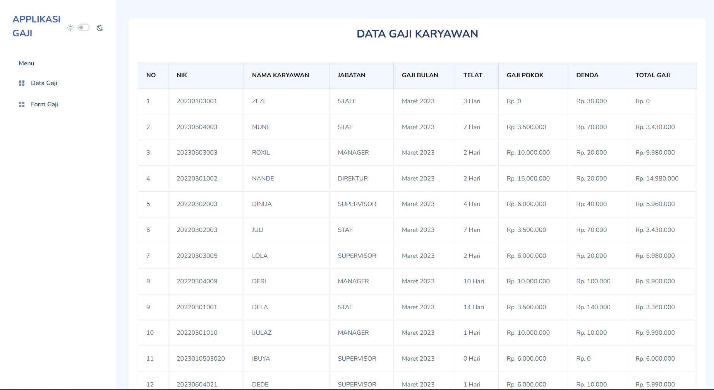

<h1>Latihan Membuat Aplikasi gaji karyawan</h1>
<h3>tools</h3>
<ul>
    <li>laravel 10 </li>
    <li>mazer template </li>
</ul>
</img>
## License

The Laravel framework is open-sourced software licensed under the [MIT license](https://opensource.org/licenses/MIT).
# data-gaji-laravel
